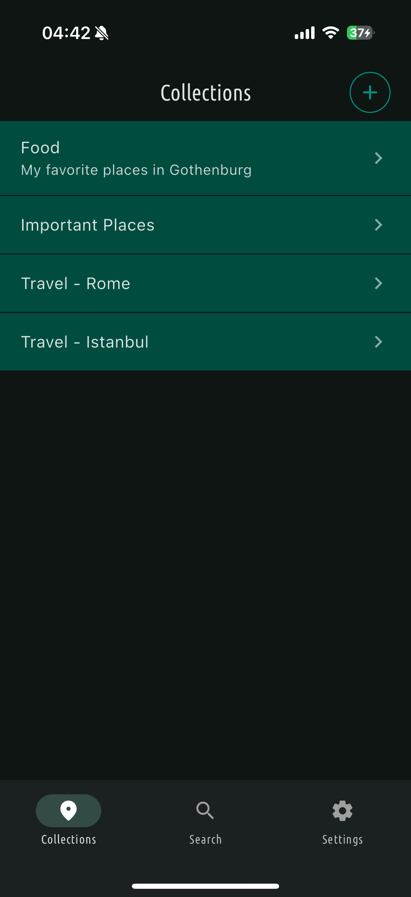
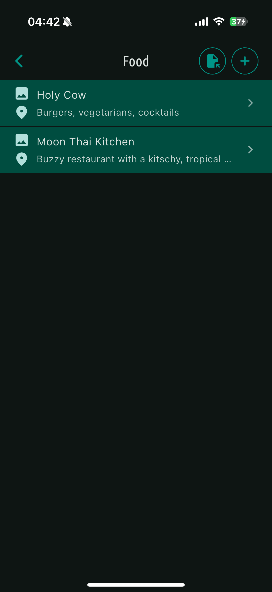
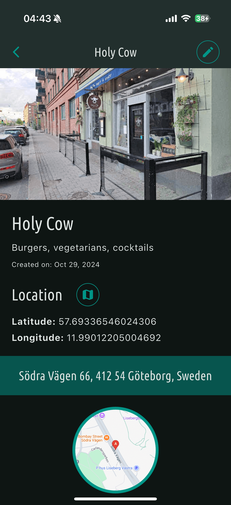
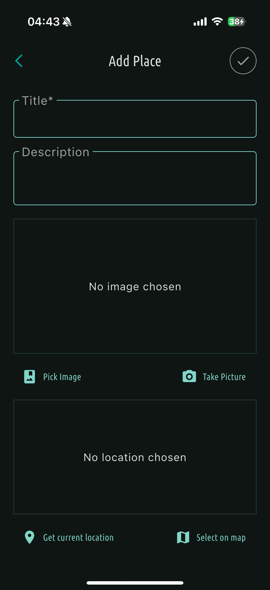

# Spotly

### About

The `Spotly` app is designed for saving and exploring locations using **Google Maps**, allowing
users to add their favorite spots effortlessly. With this app, you can capture an image of your
location, edit it, and save it. `Spotly` enables you to store, annotate, organize, and share your
favorite places in a user-friendly manner.

Discovered an interesting location? Give it a title, add text notes, and upload an image from your
camera roll or take a new one directly with your device's camera. You can also edit or delete any
location. Keep your places organized by grouping them into Collections. For instance, if you're on
holiday in London and want to remember the beautiful spots you visited, simply create a collection
named **Holiday in London** and add your visited locations, possibly including some lovely pictures
and their coordinates.

Use the search feature to find distant places by name, and customize app settings to your liking,
such as enabling notifications or switching to light mode. Share your favorite locations with
friends!

The `Spotly` app was developed by students at **Gothenburg University** as part of the **TIG333**
course in October 2024. © All Rights Reserved

Developers: `Ali Ahsani`, `Filip Drincic`, `Tim Karlsson`, `Zane Neurothrone`

### Technology Stack

The `Spotly` app is developed using **Flutter**, a powerful UI toolkit created by **Google**, which
allows for building natively compiled applications for mobile, web, and desktop from a single
codebase. The app leverages the **Dart** programming language, enabling efficient development and
performance optimization.

### Images

 
 
 

